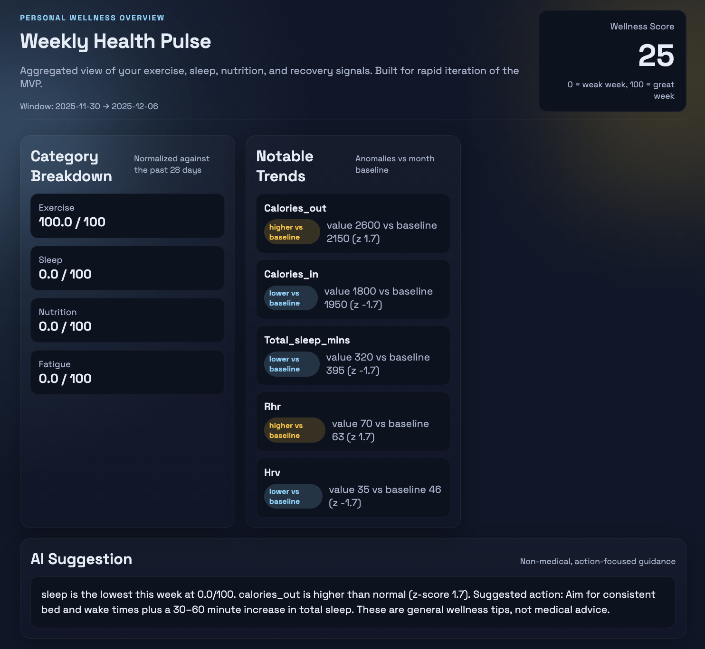
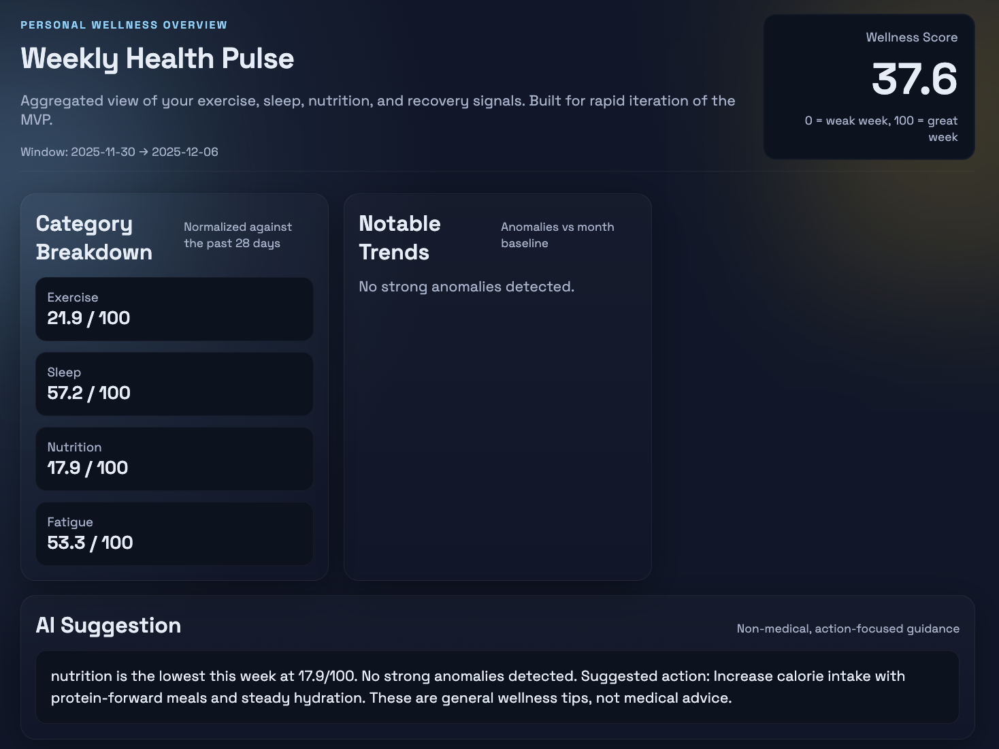
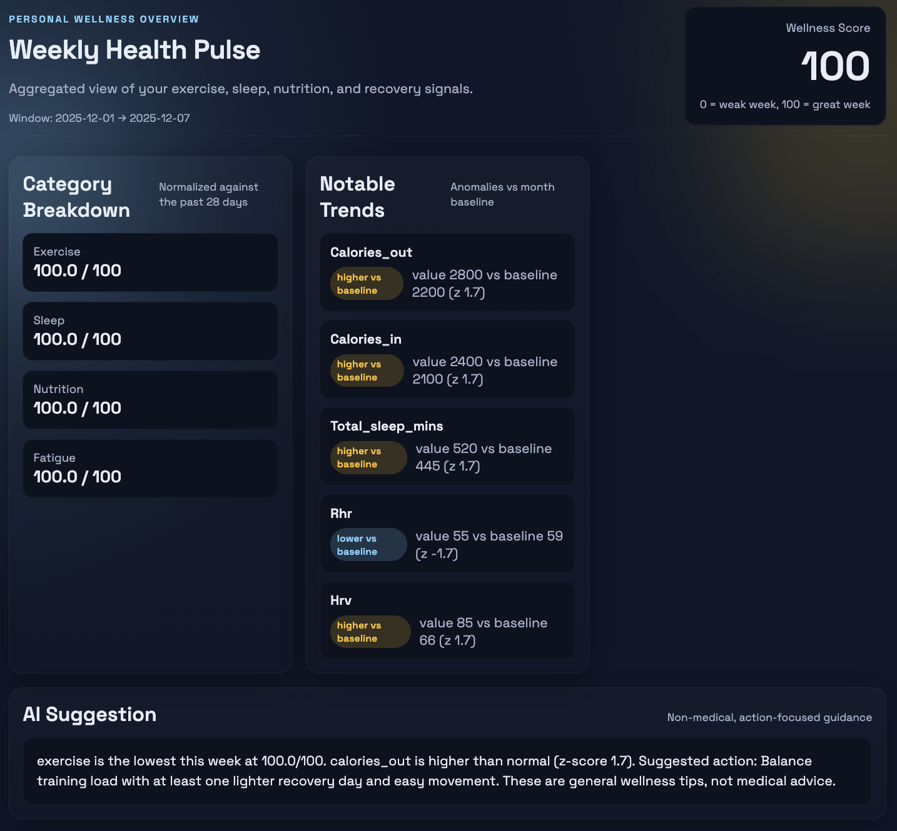

# Hackathon Case Study: Personal Health & Wellness Aggregator

## Problem Statement: 
Health-conscious individuals are often drowning in data from a
multitude of disconnected sources—a wearable tracking sleep, an app for logging nutrition, a
smart scale for weight, and a blood pressure monitor. This data fragmentation makes it nearly
impossible to see the bigger picture and understand the complex interplay between diet,
exercise, sleep, and overall well-being.

## Your Challenge: 
Build an intelligent platform that unifies disparate health data streams to
provide a single, holistic view of a user's wellness, transforming raw numbers into actionable,
personalized insights.

## Target Audience:
- Fitness enthusiasts who want to optimize their training and recovery by understanding
how sleep and nutrition impact performance.
- Health-conscious individuals seeking to make informed lifestyle choices based on their
own data.
- People managing chronic conditions who need to track multiple health metrics and
understand their correlations.

## Submission Requirements
- Working Prototype/Demo: A functional application that demonstrates your chosen MVP features. This can be a web app, a command-line tool, or a compelling interactive simulation.
- Presentation (5-7 minutes): A concise video recording covering the problem, your solution's core features, a live demonstration, and your key learnings and challenges.
- Design Documentation: A document outlining your design choices, the technical stack used (programming languages, libraries, AI models), and potential future enhancements.

## Case Challenge: How You'll Be Scored
- Problem Understanding: How clearly you define the problem and align your solution to
it.
- Technical Rigor: The quality and soundness of your technical approach, including how
you apply AI.
- Creativity: Your originality, practicality, and forward-thinking in designing the solution.
- Prototype Quality: How well your demo works and communicates your core concept.
- Responsible AI: Awareness of ethical considerations, security, and limitations.

## Demo: [Youtube Link](https://youtu.be/PR6yvQSy1yo)

Example with health data anomalies

Example without anomalies

Example with high wellness score
